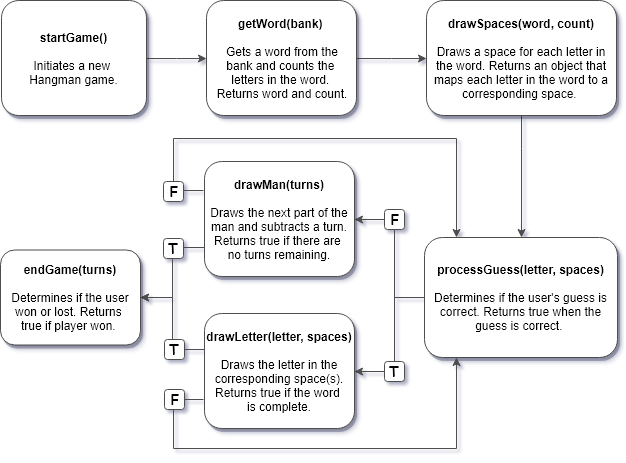

# Logic Flow

This diagram illustrates the logic flow of the methods used in the Hangman game.

<br>



# Methods

The methods used in the Hangman game are detailed below.

## drawLetter(letter, spaces)

This method draws the letter in the corresponding space(s).

<h3>Parameters</h3>

| Parameter | Type | Description |
|-----------|------|-------------|
| `letter` | String | The user's guess |
| `spaces`  | Map Object | Maps the letters in the word to corresponding spaces using a set of key: value pairs, where the key is an integer that indicates the space number and the value is an array that contains the letter for that space and a Boolean that indicates whether the letter has been guessed by the user |

<h4>Code Sample</h4>

The below demonstrates an instance of the `spaces` object.

```JavaScript
var spaces = {
  1: [L, false],
  2: [U, false],
  3: [C, false],
  4: [K, false]
}
```

<h3>Returns</h3>

| Type | Description |
|------|-------------|
| Boolean | Returns true if the word is complete or false if the word is not complete |

## drawMan(turns)

This method draws the next part of the man and subtracts a turn.

<h3>Parameters</h3>

| Parameter | Type | Description |
|-----------|------|-------------|
| `turns` | Integer | The number of remaining guesses |

<h3>Returns</h3>

| Type | Description |
|------|-------------|
| Boolean | Returns true if there are zero remaining guesses or false if there are more than zero remaining guesses |


## drawSpaces(count)

This method draws a space for each letter in the word and maps the location of each letter to a space.

<h3>Parameters</h3>

| Parameter | Type | Description |
|-----------|------|-------------|
| `count` | Integer | The number of letters in the word |

<h3>Returns</h3>

| Type | Description |
|------|-------------|
| Map Object |  Maps the letters in the word to corresponding spaces using a set of key: value pairs, where the key is an integer that indicates the space number and the value is an array that contains the letter for that space and a `false` Boolean that indicates the user has not guessed the letter |

<h4>Code Sample</h4>

The below demonstrates an instance of the map object returned by the method.

```JavaScript
var spaces = {
  1: [L, false],
  2: [U, false],
  3: [C, false],
  4: [K, false]
}
```

## endGame(turns)

This method ends the game and determines if the user won or lost the game.

<h3>Parameters</h3>

| Parameter | Type | Description |
|-----------|------|-------------|
| `turns` | Integer | The number of remaining guesses |

<h3>Returns</h3>

| Type | Description |
|------|-------------|
| Boolean | Returns true if the user won the game or false if the user lost the game |

## getWord(bank)

This method selects a word from the word bank and then counts the letters in the word. The word bank is stored in a separate file.

<h3>Parameters</h3>

| Parameter | Type | Description |
|-----------|------|-------------|
| `bank` | Array | An array of strings, where each string is a word |

<h3>Returns</h3>

| Type | Description |
|------|-------------|
| String | The word the player will guess |
| Integer | The number of letters in the word |

## processGuess(letter, spaces)

This method is called when the user makes a guess. It determines if the user's guess is correct.

<h3>Parameters</h3>

| Parameter | Type | Description |
|-----------|------|-------------|
| `letter` | String | The letter the user guessed. Must be a single character from the alphabet |
| `spaces` | Map Object |   Maps the letters in the word to corresponding spaces using a set of key: value pairs, where the key is an integer that indicates the space number and the value is an array that contains the letter for that space and a Boolean that indicates whether the letter has been guessed by the user |

<h4>Code Sample</h4>

The below demonstrates an instance of the `spaces` object.

```JavaScript
var spaces = {
  1: [L, false],
  2: [U, false],
  3: [C, false],
  4: [K, false]
}
```

<h3>Returns</h3>

| Type | Description |
|------|-------------|
| Boolean | Returns true if the letter was in the word |

## startGame()

This method starts a new Hangman game.

<h3>Parameters</h3>

None

<h3>Returns</h3>

None
